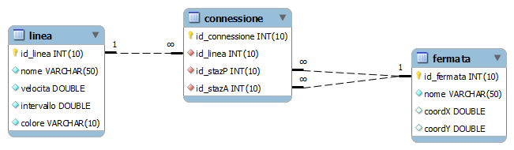

# Esercizio "Metro Paris"

Si vuole costruire un grafo che permetta la ricerca dei percorsi all'interno della Metropolitana di Parigi.

Il grafo dovrà avere le seguenti caratteristiche:
- il grafo sarà semplice, orientato, non pesato
- ciascuna `Fermata` corrisponde ad un vertice del grafo
- due vertici saranno collegati da un arco se e solo se esiste almeno una `Connessione` tra le due fermate.

## Costruzione del grafo

Si sperimentino tre diverse modalità di costruzione degli archi del grafo:

1.  doppio loop sulle coppie di vertici, per ogni coppia fare una query per determinare se esiste l'arco o meno
1.  singolo loop sui vertici, per ogni vertice fare una query che restituisca l'elenco di tutti i vertici che dovranno essere adiacenti
1.  nessun loop, singola query che produce "subito" tutto il grafo.

## Visita del grafo

- Permettere all'utente di selezionare una stazione di partenza.
- Visitare il grafo partendo da tale stazione
     - provare sia con la visita in ampiezza, che in profondità
- Stampare l'elenco dei vertici raggiunti nella visita

### Estensioni possibili

Si considerino le seguenti possibili estensioni:
- il grafo è un grafo pesato, in cui il peso rappresenta il numero di `Linee` che connettono le due `Fermate`
- il grafo è un multi-grafo, in cui se esistono più `Linee` che collegano due `Fermate`, allora saranno aggiunti altrettanti archi.
     - il multi-grafo viene pesato, calcolando come peso il tempo di percorrenza tra le due `Fermate`. Per tale calcolo si utilizzi la `velocita` dichiarata per la linea, tenendo conto della distanza in linea d'aria tra le due `Fermate`

## Cammini minimi

- Estendere l'esercizio precedente al calcolo dei cammini più veloci tra due stazioni date. Per determinare il tempo di percorrenza di ciascuna tratta (arco) si consideri la velocità media della linea che connette le due fermate (Linea.velocita) e la distanza tra le stazioni in linea d'aria (Fermata.coords). Nel caso in cui due stazioni siano connesse da più linee, si consideri quella più veloce.

- In questo caso il grafo dovrà essere semplice, orientato e pesato.

- Date due fermate, calcolare il cammino più breve (utilizzando l'algoritmo di Dijkstra) e visualizzarlo. 

### Estensioni possibili

- Si vorrebbe modellare anche il tempo di attesa in ciascuna stazione. A questo scopo, ad ogni arco si sommi un tempo pari a metà (statisticamente) della frequenza di passaggio dei treni della linea. In questo caso è come se, ad ogni stazione, dovessimo scendere e riprendere un nuovo treno.

- Si vorrebbe modellare il fatto che, se rimango sulla stessa linea, non ho il ritardo di attesa. L'algoritmo dovrebbe quindi fornirmi soluzioni che tengano conto dei tempi di cambio realistici, e quindi prediligere percorsi con un numero minore di cambi. In questo caso occorre:

    - predisporre un multi-grafo orientato e pesato
    - trasformare ciascuna Fermata in un insieme di nodi: ogni Fermata verrà moltiplicata per le Linee che vi transitano. In questo caso non vi è più la corrispondenza diretta tra gli elementi del problema (le fermate e le linee) e la struttura del grafo.
    - il tempo per passare da una linea di una fermata ad un'altra linea della stessa fermata sarà pari a metà della frequenza di passaggio
    - il tempo per passare da una stazione+linea ad un'altra stazione+linea (dove la linea è ovviamente la stessa) tiene conto della velocità di percorrenza e della distanza in linea d'aria.

## Classi del Model
     

    